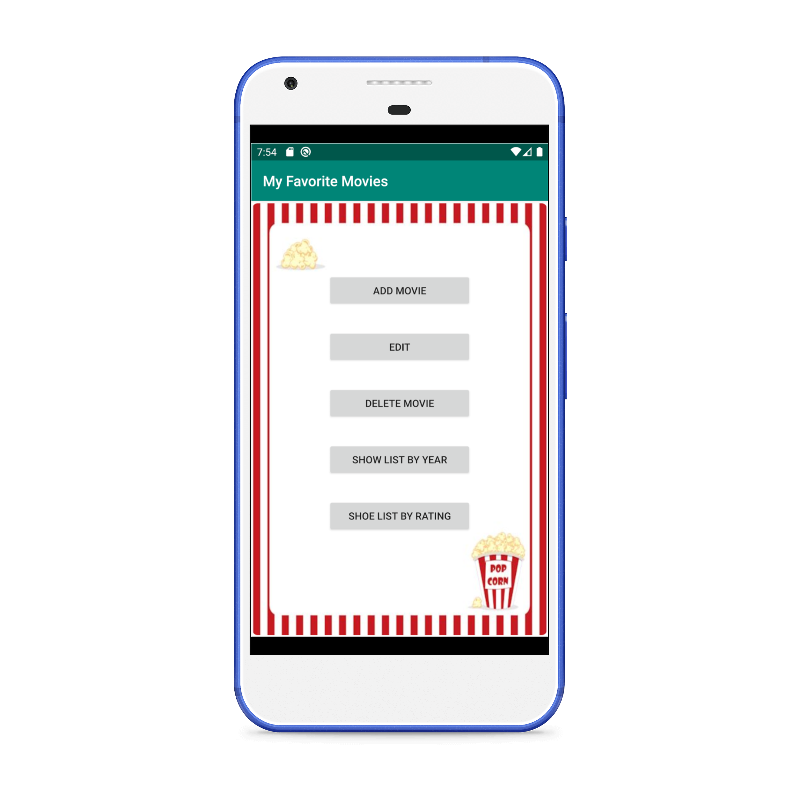

# WineFlix

Developed using Firebase’s Cloud Firestore NoSQL database, this App lets you store your favorite movies and retrieve them anytime using JSON API calls to themoviedb.org. Android Recycler View, OkHttp, Data passing between Intents (Parcelable/Simple Data Passing) are some of the additional functionalities implemented.

